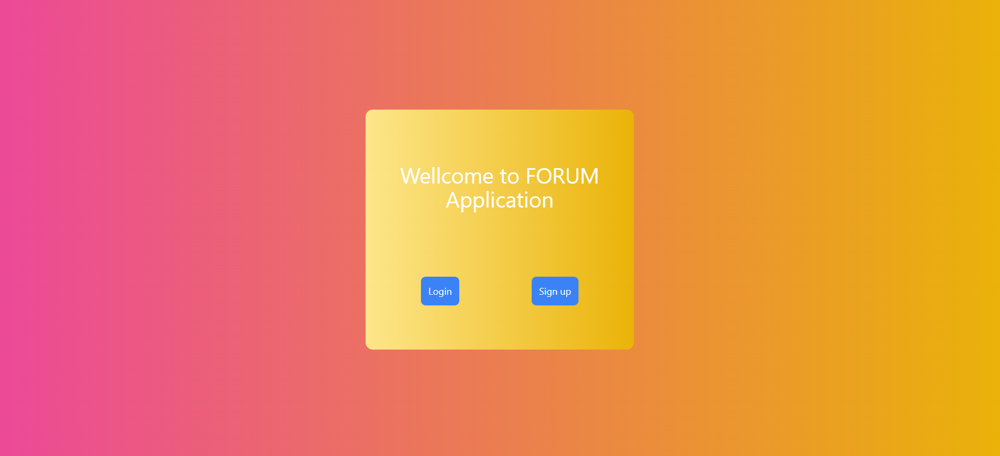
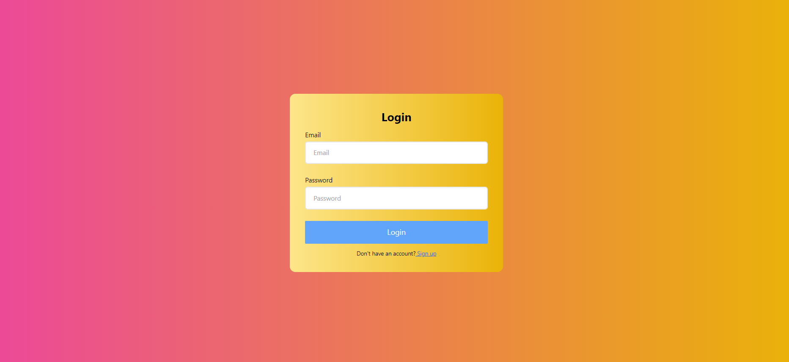
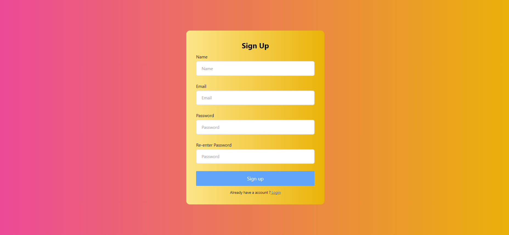
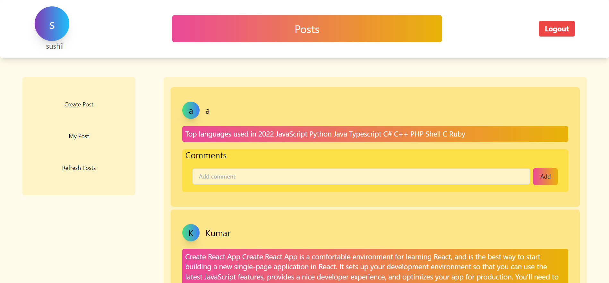

# forum-Application-backEnd
a “Forum Application” where the users can come, create posts, and read other posts that are posted by other users

## [Live Preview](https://forum-application.netlify.app/)

### SnapShot of the Webpage

